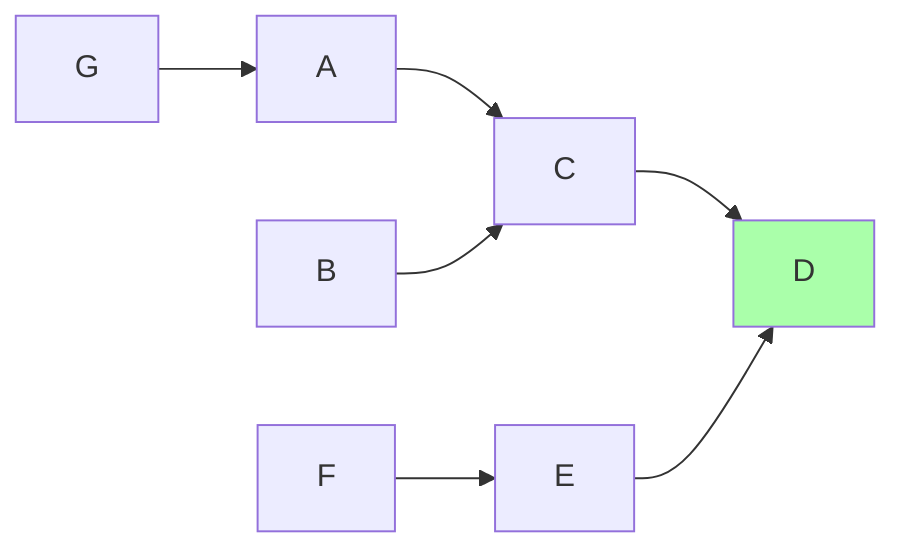
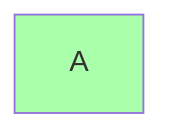
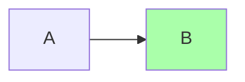
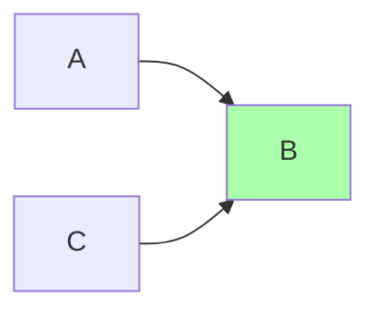
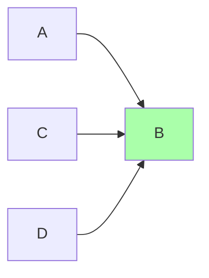
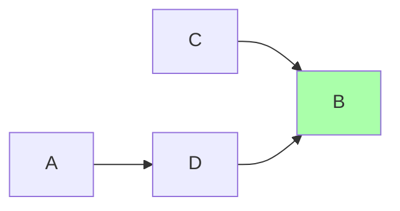

<head>
  <title>Ref | Distributions</title>
</head>

Distributions provide a means of defining a path through element versions within a node group. Each distribution is associated with exactly one element version and node group as well as up to one distribution that represents the next step in the graph. The next step is configured via the distribution's `next_distribution_id` field. A node group's distributions form an anti-arborescence or in-tree, for example below:



Wihthin a node group's distribution graph, only up to one distribution at any given time within that graph is allowed to have a `next_distribution_id` of `null`. That distribution, "D" above, is referred to as the head distribution of that node group's distribution graph.

## Examples

### Creating the first distribution within a node group

```shell
peridio distribution create \
  --name A \
  --node-group-id ... \
  --element-version-id ...
```

Resulting in:



### Appending a new head distribution

```shell
peridio distribution create \
  --name B \
  --node-group-id ... \
  --element-version-id ...
```

Resulting in:



Note that to create a new head distribution you do not supply a `next_distribution_id`. "A" is automatically updated for you to set its `next_distribution_id` appropriately.

### Prepending a new non-head distribution

```shell
peridio distribution create \
  --name B \
  --node-group-id ... \
  --element-version-id ... \
  --next-distribution-id ... # ID of "B"
```

Resulting in:



### Inserting a new non-head distribution in between two existing distributions

```shell
peridio distribution create \
  --name D \
  --node-group-id ... \
  --element-version-id ... \
  --next-distribution-id ... # ID of "B"
```

Resulting intermediately in:



```shell
peridio distribution update \
  --id ... \ # ID of "A"
  --node-group-id ... \
  --element-version-id ... \
  --next-distribution-id ... # ID of "D"
```

Resulting in:


