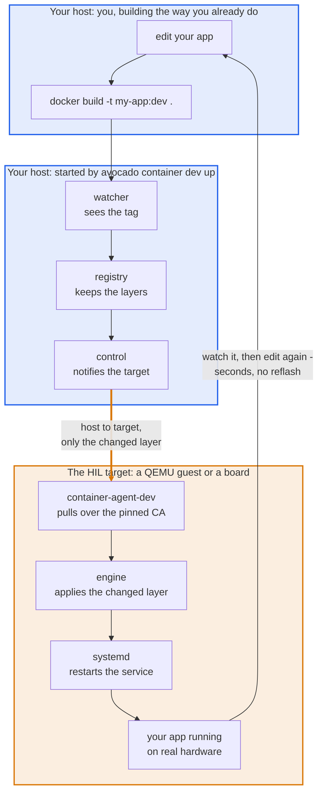
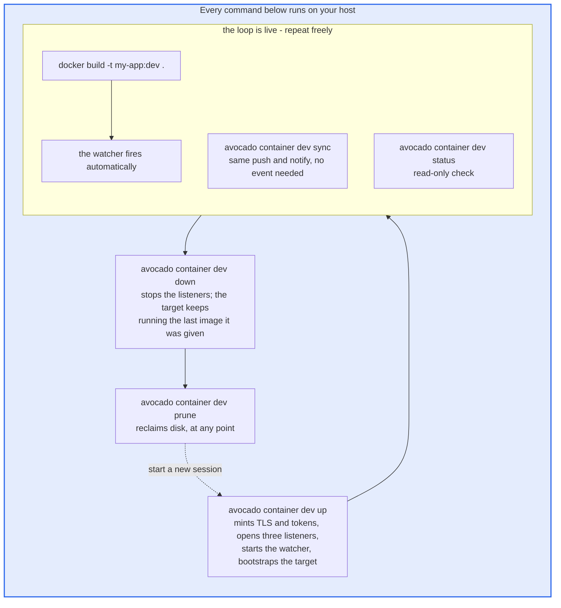
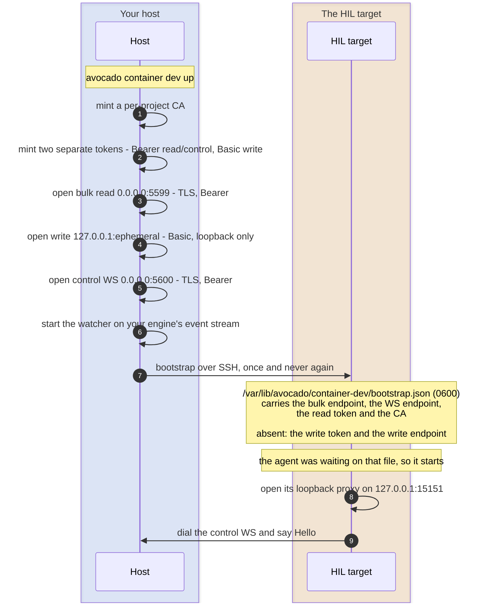
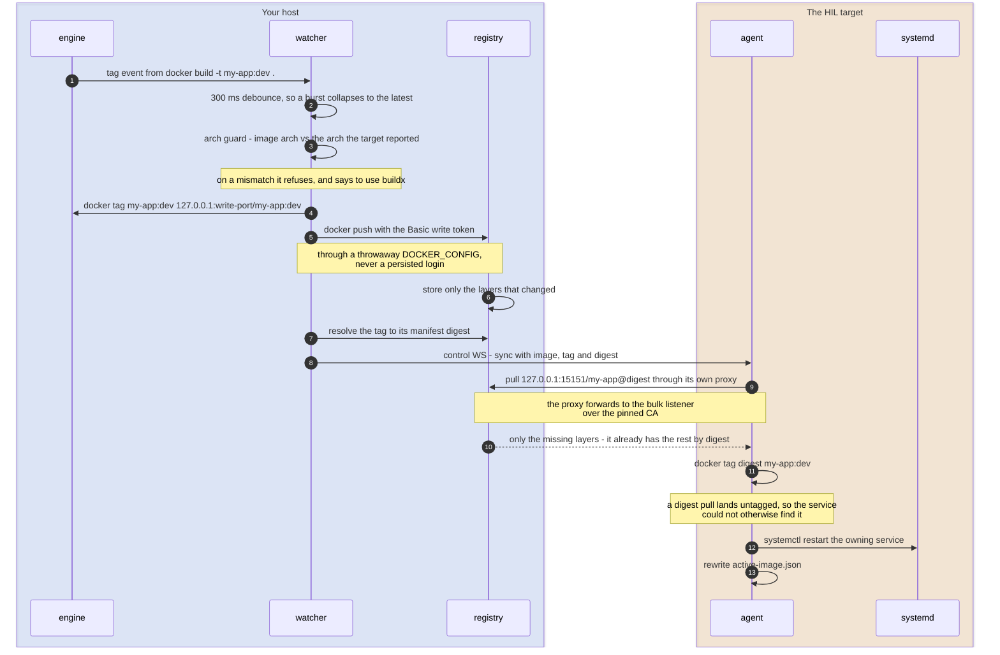
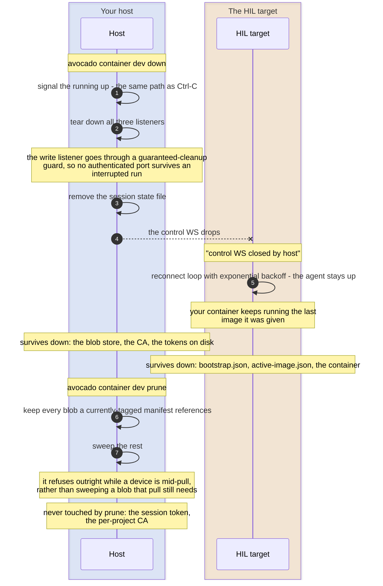

Container dev mode is the inner development loop for a containerized application running on an Avocado OS device. You keep building images the way you already do (`docker build`), and the changed layer is pushed to the device and the container restarted, in place, on the running system. There is no reflash, no full image re-transfer, and no rebuild of the OS.

This matters because Avocado OS has an immutable root filesystem. Without a dev loop, every application change means either re-shipping the whole container image to the device or rebuilding and reprovisioning the system, which is slow enough to break concentration when the image is measured in gigabytes. Container dev mode reuses the container engine's own pull protocol so only the layers that actually changed move across the wire.

If you have used [hardware in the loop](./hardware-in-the-loop) to iterate on extensions, this is the same idea applied to containers: a host-side server, a live device, and a feedback loop measured in seconds.

:::info
Run all commands in this guide from the root of your Avocado project on your host machine, the directory that contains your Avocado config.
:::

:::warning Development only
Container dev mode is a development feature. The device-side agent ships as its own extension so it is present only in a dev runtime and absent from production runtimes. It opens an authenticated registry endpoint on your host for the device to pull from. Do not enable it on production devices, and do not use it as a production container delivery mechanism.
:::

## How it works

The loop keeps a real device in it. You edit and build on your machine, the changed layer crosses to the device, and the service restarts there, so what you are looking at is your code running on the target rather than an emulator of it. A QEMU target and a physical board are the same thing to this loop: both are just an SSH-reachable device.

:::info Reading the diagrams on this page

Which machine a step runs on is the thing to keep straight, so every figure says it twice - once in the group's label, once in colour:

- **Blue** - on **your host**: you, your build, and everything `avocado container dev up` starts.
- **Amber** - on the **HIL target**: the agent, the target's own engine, and your service.
- A **thick amber arrow** is the one hop that actually crosses the network.

The labels carry the meaning on their own, so the figures still read correctly in greyscale or with colour blindness.

:::



When you run `avocado container dev up`, the CLI:

1. Mints a per-project certificate authority and two separate session tokens (one for reading and control, one for writing).
2. Starts an embedded OCI registry on your host, with a dedicated bulk read listener and a distinct write listener.
3. Starts a watcher on your container engine that streams tag events.
4. Opens a control WebSocket the device connects back to.
5. Writes the bootstrap once over SSH to the device's writable partition: the bulk listener endpoint, the read and control token, and the CA certificate.

After that, steady state runs over the control WebSocket with no further SSH. When a build retags a watched image, the watcher notices, pushes the changed layers into the embedded registry, and notifies the device. The device-side agent pulls over the pinned CA and restarts the mapped service. Whether your build emits the event the watcher needs depends on the builder, so read [Iterate](#iterate) before relying on it firing on its own.

## Two machines: your host and the HIL target

Every command below runs on one of two machines, and mixing them up is the most common way this loop appears broken while reporting no error at all.

**Your host** is where you edit, where `docker build` runs, and where `avocado container dev` runs. The embedded registry and the watcher live here.

**The HIL target** is the machine running Avocado OS with your container on it - the hardware in the loop. It runs the device agent and your service. It is a QEMU target or a physical board; the loop does not care which, and neither does anything on this page.

| Runs on    | What                               | Examples                                                     |
| ---------- | ---------------------------------- | ------------------------------------------------------------ |
| Host       | edit, build, serve layers          | `docker build`, `avocado container dev up/sync/status/down`  |
| HIL target | run the container, apply the layer | your service, `container-agent-dev`, the target's own engine |

The consequence that catches people: **your host's container engine never runs your app.** The container runs on the HIL target, under the target's own engine. So on your host:

```bash title="On Host"
docker logs my-app          # Error: No such container: my-app
```

That error is correct, not a fault. To watch your app, look at the target:

```bash title="On HIL target"
# over SSH to the target
docker logs -f app                    # the target's engine, where your container runs
journalctl -u app.service -f          # the service the agent restarts
journalctl -u avocado-container-agent-dev -f   # pull + restart, as the agent sees it
```

This is the same host/target split as [hardware in the loop](./hardware-in-the-loop.md), which does for extensions what this page does for containers. If you already run HITL, the mental model carries over unchanged.

## Prerequisites

- A HIL target running Avocado OS, reachable over SSH from your host.
- A container engine on your host. Both `docker` and `podman` are supported. The watcher streams tag events from the engine CLI (`docker events` / `podman events`) rather than the API socket, so a rootless podman with no socket still works.
- Two extensions in your dev runtime: a container engine extension (`avocado-ext-docker` or `avocado-ext-podman`) and the dev agent extension `avocado-ext-container-agent-dev`.
- **A systemd service on the target that already runs your container.** Container dev mode restarts that service; it does not create it. Ship it with your runtime the way you ship any other service.

The service must recreate the container **from the image tag** on every start:

```ini title="On HIL target"
[Service]
ExecStartPre=-/usr/bin/docker rm -f app
ExecStart=/usr/bin/docker run --rm --name app my-app:dev
```

A unit that instead restarts an existing container will silently keep running the old code. An engine `restart` re-runs the image ID pinned when the container was created, so the freshly pulled layer is fetched, the restart succeeds, every log line looks healthy, and the app never changes. Re-running `docker run` re-resolves the tag, which is what actually adopts the new image.

## Configure the runtime

Container dev mode is enabled structurally: the presence of a `container_dev` block under a runtime turns it on for that runtime. A block placed anywhere else is not honored.

```yaml title="avocado.yaml"
default_target: qemux86-64
supported_targets:
  - qemux86-64

runtimes:
  dev:
    extensions:
      - avocado-dev
      # highlight-added-start
      - avocado-ext-docker
      - avocado-ext-container-agent-dev
      # highlight-added-end
    packages:
      avocado-runtime: '*'
    # highlight-added-start
    container_dev:
      images:
        - ref: my-app:dev
          service: app
    # highlight-added-end
```

Each entry maps the two sides: `ref` is an image you build **on your host**, `service` is the systemd unit that runs it **on the HIL target**. When a watched image is retagged, the agent pulls the new layers and restarts that unit.

Both names must already be real. `ref` has to match the tag you actually build, byte for byte, or the watcher ignores your rebuild. `service` has to name a unit that already exists on the target (see [Prerequisites](#prerequisites)) - container dev mode restarts it, it does not create it.

Only one runtime may enable container dev mode per config. If two runtimes carry a `container_dev` block, the CLI refuses to start and names them both.

## Point the CLI at your HIL target

The subcommands take no positional arguments. The target is sourced from the environment, which also lets the CLI auto-detect which host address the target can reach:

```bash title="On Host"
export AVOCADO_CONTAINER_DEV_DEVICE=root@192.168.1.50
```

## The execution cycle

Five commands cover the whole life of a session. `up` and `down` bracket it, and
everything in between is repeatable as many times as you like.



`status` and `prune` are read-mostly and safe to run whenever. `prune` does not
need the session stopped first - it refuses to sweep a blob a device is still
pulling rather than racing it.

The three stages below are that same cycle in detail.

### Stage 1 - what `up` does, once

The only step that touches the device over SSH. Steady state never re-opens it.



The write token and the write listener's address are the two things the device is
never told. That is deliberate: a compromised device cannot push into your
registry, because it does not know where to send it and its token is refused by
write routes anyway.

### Stage 2 - one iteration

This is what a `docker build` sets off. `sync` runs the same path, entering at the
push step instead of waiting for an event.



The digest sent on the wire is the **registry manifest** digest, not your engine's
local image ID - the device pulls by digest, so it has to be one the registry can
serve. And the owning **service** is restarted rather than the container: an engine
`restart` re-runs the image ID pinned when the container was created, so the layer
you just pushed would never actually run.

### Stage 3 - `down`, then `prune`



Because `down` leaves the device's bootstrap in place and the agent reconnecting, a
later `up` picks the device straight back up - and the agent's `Hello` reports the
digest it is currently running, so the host knows whether anything needs re-sending.

If the device was offline during an `up`, it may present a token from the previous
session. That is the one case `status` calls out, and re-running `up` re-bootstraps
it.

## Start the loop

```bash title="On Host"
avocado container dev up
```

This bootstraps the device and leaves the registry, watcher, and control WebSocket running.

## Iterate

Build your image the way you normally would. No wrapper command is required:

```bash title="On Host"
docker build -t my-app:dev .
```

The watcher observes the tag event, pushes the changed layers, and notifies the device, which pulls them and restarts the `app` service. Layers that did not change are already present on the device by digest and are not re-sent.

:::caution Older Docker daemons do not report BuildKit builds

The watcher reads tag events from the engine's event stream. Docker only began emitting an image event for BuildKit builds in later releases, so on an older daemon a `docker build` is invisible to the watcher and nothing is pushed.

Measured: docker 29.6.2 emits `image tag` for a BuildKit build and the loop runs unattended; docker 20.10.24 emits nothing at all. The exact release that changed is not pinned here, so treat anything before Docker 23 as affected.

Check the daemon that runs your builds:

```bash title="On Host"
docker version --format '{{.Server.Version}}'
```

On an affected daemon, either build with the classic builder so it emits the event:

```bash title="On Host"
DOCKER_BUILDKIT=0 docker build -t my-app:dev .
```

or keep BuildKit and trigger the sync yourself:

```bash title="On Host"
docker build -t my-app:dev .
avocado container dev sync
```

The explicit trigger is the more durable of the two, since it does not consult the event stream at all and Docker has deprecated the classic builder. Podman is unaffected.

:::

## Force a sync

`sync` re-pushes the current watched images and notifies the device without waiting on an event. Use it when the watcher cannot see your build - a cross-arch `buildx` build emits no tag event whatever the daemon version, and neither does a BuildKit build on a daemon older than Docker 23 - or any time you want to re-push without rebuilding:

```bash title="On Host"
avocado container dev sync
```

## Check the loop state

```bash title="On Host"
avocado container dev status
```

`status` reports registry, watcher, and last-sync state. It also surfaces the case where a device presents a stale token and needs `up` to be re-run to re-bootstrap.

## Stop the loop

```bash title="On Host"
avocado container dev down
```

`down` stops the listeners and tears down the write listener through a guaranteed-cleanup guard, so an interrupted session does not leave an authenticated write port bound.

## Reclaim disk

The embedded registry keeps a per-project store of pushed blobs. To garbage-collect it:

```bash title="On Host"
avocado container dev prune
```

This is scoped to the container dev mode store and is distinct from the top-level `avocado clean`, which removes Docker volumes and project state.

## Command reference

| Command                        | Purpose                                                                |
| ------------------------------ | ---------------------------------------------------------------------- |
| `avocado container dev up`     | Start the dev registry and watcher, and bootstrap the device.          |
| `avocado container dev sync`   | One-shot re-push of the current watched image, then notify the device. |
| `avocado container dev status` | Report registry, watcher, and last-sync state.                         |
| `avocado container dev down`   | Stop the registry and watcher, and tear down the listeners.            |
| `avocado container dev prune`  | Garbage-collect this project's container dev mode registry store.      |

## Configuration reference

| Key                                              | Required | Description                                                           |
| ------------------------------------------------ | -------- | --------------------------------------------------------------------- |
| `runtimes.<name>.container_dev`                  | yes      | Presence of the block enables the feature for that runtime.           |
| `runtimes.<name>.container_dev.images[].ref`     | yes      | Image reference (`repository[:tag]`) watched on the host engine.      |
| `runtimes.<name>.container_dev.images[].service` | yes      | Device service that consumes the image and is restarted after a pull. |
| `runtimes.<name>.container_dev.registry.port`    | no       | Port for the bulk read listener. Defaults to `5599`.                  |

## Environment variables

| Variable                           | Purpose                                                                                                     |
| ---------------------------------- | ----------------------------------------------------------------------------------------------------------- |
| `AVOCADO_CONTAINER_DEV_DEVICE`     | Device SSH target (`user@host`). Required by `up`.                                                          |
| `AVOCADO_CONTAINER_DEV_VM`         | Engine guest SSH target. Only used when pushing through a helper VM engine.                                 |
| `AVOCADO_CONTAINER_DEV_HOST`       | Override host address auto-detection.                                                                       |
| `AVOCADO_CONTAINER_DEV_PORT`       | Override the bulk read listener port.                                                                       |
| `AVOCADO_CONTAINER_DEV_WS_PORT`    | Override the control WebSocket port.                                                                        |
| `AVOCADO_CONTAINER_DEV_WRITE_PORT` | Pin the write listener port instead of binding an ephemeral one. Only needed on the `avocado-vm` push path. |

## Default ports

| Port        | Listener                                                        |
| ----------- | --------------------------------------------------------------- |
| `5599`      | Bulk read (the device pulls image layers from here).            |
| `5600`      | Control WebSocket.                                              |
| _ephemeral_ | Write (your host's engine pushes here), bound on loopback only. |

The write listener does not have a fixed default port. It binds an ephemeral
loopback port that changes every session, and the address is never disclosed to
the device. `up` reports the port it chose:

```
write listener loopback-only on 127.0.0.1:34813
```

`AVOCADO_CONTAINER_DEV_WRITE_PORT` pins it to a known value, which is only needed
when pushing through an `avocado-vm` engine guest - there the guest's per-registry
trust store and the pushed tag are both keyed on that port, so it cannot be
ephemeral.

Port `5000` is deliberately avoided because it collides with the AirPlay receiver on macOS.

## Trust model

Each `up` mints fresh TLS material and two distinct tokens for the project. The read and control token is what lands on the device at bootstrap; the write token never leaves the host side of the push. The CA is delivered to the device's writable partition at bootstrap rather than baked into the image, so no long-lived credential ships in a runtime.

## Limitations

- One runtime per config may enable container dev mode.
- Promotion of a dev image into a production runtime is not part of this feature. Production container delivery continues to use the existing paths.
- The device agent extension is development only and must not be included in a production runtime.
