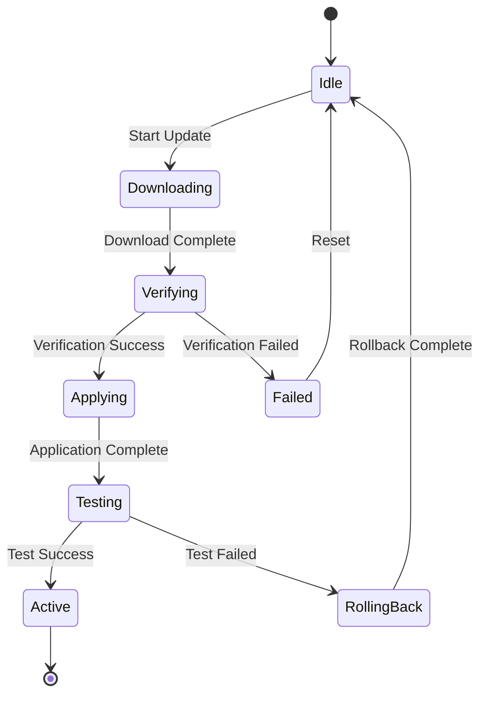

:::info Under Construction
This documentation is currently under development. Content and features may change as we continue to improve and expand the Avocado OS platform.
:::

Avocado OS provides enterprise-grade update mechanisms that ensure devices can be safely and reliably updated in the field. The system supports atomic updates, automatic rollback, differential updates, and comprehensive recovery options.

## Atomic Update Architecture

### A/B Partition Scheme

Avocado OS uses a dual-partition architecture for fail-safe updates:

```
┌─────────────────────────────────────┐
│         Boot Partition              │
│      (Bootloader + Config)          │
├─────────────────────────────────────┤
│      System A (Active)              │ ← Currently running
│   - Kernel A                        │
│   - Rootfs A                        │
│   - Extensions A                    │
├─────────────────────────────────────┤
│      System B (Inactive)            │ ← Update target
│   - Kernel B                        │
│   - Rootfs B                        │
│   - Extensions B                    │
├─────────────────────────────────────┤
│       Data Partition                │ ← Persistent data
│   - User data                       │
│   - Application state               │
│   - Configuration                   │
└─────────────────────────────────────┘
```

### Update Transaction Flow

The atomic update process ensures consistency:

```bash
# 1. Download update bundle
avocado-update download --version 2.0.0

# 2. Verify signatures and integrity
avocado-update verify --bundle update-2.0.0.avb

# 3. Apply to inactive partition
avocado-update apply --target inactive

# 4. Set boot flag to new partition
avocado-update commit

# 5. Reboot to new version
systemctl reboot

# 6. Confirm successful boot
avocado-update confirm  # Automatic after health checks
```

### Update State Machine

Track update progress through defined states:



### Delta Updates

Minimize bandwidth with differential updates:

```bash
# Generate delta update
avocado-update create-delta \
  --from version-1.0.0 \
  --to version-2.0.0 \
  --output delta-1.0-2.0.avb

# Apply delta update
avocado-update apply-delta \
  --delta delta-1.0-2.0.avb \
  --verify

# Delta update statistics
avocado-update delta-stats \
  --from 1.0.0 \
  --to 2.0.0
# Output: Full size: 500MB, Delta size: 45MB (91% reduction)
```

## Rollback Procedures

### Automatic Rollback Triggers

Configure conditions that trigger automatic rollback:

```yaml
# /etc/avocado/rollback.yaml
rollback:
  triggers:
    # Boot failure detection
    boot_failure:
      enabled: true
      max_attempts: 3
      timeout: 120s
    
    # Service health checks
    service_health:
      enabled: true
      critical_services:
        - avocado-core
        - network-manager
        - update-agent
      check_interval: 30s
      failure_threshold: 2
    
    # System metrics
    system_metrics:
      enabled: true
      conditions:
        - metric: memory_usage
          threshold: 95%
          duration: 5m
        - metric: cpu_temperature
          threshold: 85C
          duration: 2m
    
    # Application validation
    app_validation:
      enabled: true
      script: /usr/local/bin/validate-system
      timeout: 60s
```

### Manual Rollback

Perform manual rollback when needed:

```bash
# Check current and previous versions
avocado-update status
# Current: 2.0.0 (Partition A)
# Previous: 1.9.0 (Partition B)

# Initiate rollback to previous version
avocado-update rollback

# Force immediate rollback
avocado-update rollback --force --now

# Rollback with data preservation
avocado-update rollback \
  --preserve-data \
  --backup-current
```

### Rollback Safety Checks

Ensure safe rollback operations:

```bash
# Verify rollback target integrity
avocado-update verify-partition --partition inactive

# Check compatibility before rollback
avocado-update check-compatibility \
  --from current \
  --to previous

# Backup critical data before rollback
avocado-update backup \
  --include /etc/avocado \
  --include /var/lib/app \
  --output rollback-backup.tar

# Test rollback in safe mode
avocado-update rollback --test --verbose
```

## Recovery Modes

### Recovery Partition

Maintain a minimal recovery system:

```bash
# Build recovery image
avocado-recovery build \
  --base avocado-image-minimal \
  --tools "network,storage,diagnostics" \
  --output recovery.img

# Install recovery partition
avocado-recovery install \
  --image recovery.img \
  --partition /dev/mmcblk0p5

# Boot into recovery mode
avocado-recovery boot

# Recovery mode utilities
avocado-recovery shell     # Recovery shell
avocado-recovery repair    # Automated repair
avocado-recovery restore   # Factory reset
avocado-recovery diagnose  # System diagnostics
```

### Network Recovery

Enable remote recovery capabilities:

```bash
# Configure network recovery
cat > /etc/avocado/network-recovery.conf << EOF
[Server]
URL = https://recovery.example.com
Certificate = /etc/ssl/recovery.crt

[Network]
Interface = eth0
DHCP = yes
Timeout = 30

[Authentication]
Method = certificate
DeviceCert = /etc/ssl/device.crt
DeviceKey = /etc/ssl/device.key
EOF

# Enable PXE recovery boot
avocado-recovery configure-pxe \
  --server 192.168.1.100 \
  --image recovery-net.img

# Remote recovery commands
avocado-recovery remote-repair \
  --device device-001 \
  --issue boot-loop
```

### USB Recovery

Create USB recovery media:

```bash
# Create bootable USB recovery
avocado-recovery create-usb \
  --device /dev/sdb \
  --image recovery-full.img \
  --include-tools \
  --include-firmware

# USB recovery features
cat > recovery-usb/autorun.sh << 'EOF'
#!/bin/bash
echo "Avocado OS Recovery"
echo "1. Restore factory image"
echo "2. Repair boot partition"
echo "3. Reset configuration"
echo "4. Advanced diagnostics"
read -p "Select option: " option
case $option in
  1) avocado-recovery factory-restore ;;
  2) avocado-recovery repair-boot ;;
  3) avocado-recovery reset-config ;;
  4) avocado-recovery diagnose --full ;;
esac
EOF
```

## Update Validation

### Pre-Update Validation

Verify system readiness before updates:

```bash
# Check system requirements
avocado-update pre-check
# ✓ Disk space: 2.5GB available (1GB required)
# ✓ Battery: 85% (or AC connected)
# ✓ Network: Connected
# ✓ System health: All services running
# ✓ Backup: Recent backup available

# Validate update compatibility
avocado-update validate \
  --bundle update-2.0.0.avb \
  --check-hardware \
  --check-dependencies

# Dry run update
avocado-update simulate \
  --bundle update-2.0.0.avb \
  --verbose
```

### Post-Update Validation

Confirm successful update deployment:

```bash
# Automated validation script
cat > /usr/local/bin/post-update-validate << 'EOF'
#!/bin/bash
set -e

# Check system version
VERSION=$(avocado-version)
echo "Running version: $VERSION"

# Verify critical services
for service in avocado-core network-manager update-agent; do
  systemctl is-active $service || exit 1
done

# Test hardware interfaces
avocado-hw-test --quick || exit 1

# Verify data integrity
avocado-data verify --checksums /var/lib/checksums || exit 1

# Application smoke tests
/opt/app/test/smoke-test.sh || exit 1

# Mark update as successful
avocado-update confirm
echo "Update validation successful"
EOF

chmod +x /usr/local/bin/post-update-validate
```

### Update Metrics and Reporting

Monitor update performance and success:

```bash
# Configure update telemetry
cat > /etc/avocado/update-telemetry.yaml << EOF
metrics:
  enabled: true
  endpoint: https://telemetry.example.com
  
  collect:
    - download_time
    - apply_time
    - boot_time
    - validation_results
    - rollback_events
    - error_logs
  
  reporting:
    interval: daily
    on_failure: immediate
EOF

# View update history
avocado-update history --detailed

# Generate update report
avocado-update report \
  --from 2024-01-01 \
  --to 2024-12-31 \
  --format json > update-report.json

# Monitor real-time update progress
avocado-update monitor --follow
```

## Integration with Update Services

### Peridio Fleet Integration

Connect to Peridio Fleet for managed updates:

```bash
# Configure Peridio agent
cat > /etc/peridio/agent.conf << EOF
[Fleet]
Organization = my-org
Product = avocado-device
Cohort = production

[Connection]
Endpoint = https://fleet.peridio.com
Certificate = /etc/peridio/device.crt
Key = /etc/peridio/device.key

[Updates]
CheckInterval = 3600
AutoDownload = true
AutoApply = false
UpdateWindow = 02:00-04:00
EOF

# Register device with fleet
peridio-agent register \
  --token $PROVISIONING_TOKEN

# Check for updates
peridio-agent check-update

# Monitor fleet connection
peridio-agent status
```

### Custom Update Server

Implement your own update infrastructure:

```python
# Simple update server example
from flask import Flask, send_file, jsonify
import hashlib

app = Flask(__name__)

@app.route('/updates/check/<device_id>')
def check_update(device_id):
    # Check if update available for device
    current_version = request.args.get('version')
    latest_version = get_latest_version()
    
    if version_compare(current_version, latest_version) < 0:
        return jsonify({
            'update_available': True,
            'version': latest_version,
            'url': f'/updates/download/{latest_version}',
            'size': get_update_size(latest_version),
            'hash': get_update_hash(latest_version)
        })
    
    return jsonify({'update_available': False})

@app.route('/updates/download/<version>')
def download_update(version):
    update_file = f'/updates/{version}/update.avb'
    return send_file(update_file, as_attachment=True)
```

## Best Practices

**Update Strategy:**
- Test updates thoroughly in staging environment
- Use phased rollouts for production deployments
- Maintain update windows for minimal disruption
- Document rollback procedures
- Monitor update metrics and success rates

**Security Considerations:**
- Always sign update bundles
- Verify signatures before applying updates
- Use secure channels for update delivery
- Implement update authentication
- Regular security audits of update infrastructure

## Next Steps

- [Porting Guide →](./porting-guide) - Adapt updates for new hardware
- [Security Implementation →](./security-implementation) - Secure update delivery
- [Architecture Overview →](./architecture-overview) - System update architecture