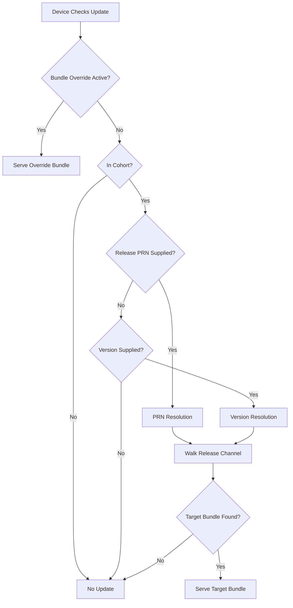

# Bundle Distribution

The process Peridio undergoes to check for an update for a device is referred to as bundle resolution. Bundle resolution determines if there is a [bundle](bundles), referred to as the target bundle, the [device](/dev-center/peridio-core/device-management/devices) can update to. This sophisticated system ensures devices receive the right updates at the right time.

## Overview

Bundle distribution is the core mechanism that determines what firmware updates devices receive. It considers multiple factors including the device's current state, cohort membership, active overrides, and release channels to resolve the appropriate target bundle.

Users may check for an update on behalf of a device via the Admin API [get-device-update](/admin-api#devices/operation/devices-get-update) route. Devices may check for an update via the Device API [get-update](/device-api#devices/operation/get-update) route.

## Bundle Resolution

A target bundle is resolved via either bundle overrides or release resolution. Understanding these two methods and their interaction is crucial for effective firmware management.

### Resolution Priority

Bundle resolution follows a strict priority order:

1. **Bundle Override Method** (highest priority)
2. **Release Resolution Method**
3. **No Update Available** (if no applicable method)

### Bundle Override Method

[Bundle overrides](bundle-overrides) are higher priority than release resolution. When an applicable bundle override exists, release resolution is not considered at all.

#### Override Behavior

- **Different Bundle**: If device is on different bundle → Serve override's bundle
- **Same Bundle**: If device has override's bundle → No update (prevents loops)
- **No Release Association**: Override continues until expired, deleted, or superseded

This state continues until:

- Bundle override is updated
- Bundle override expires
- Bundle override is deleted
- Another bundle override takes precedence

:::tip Bundle but No Release
When a device receives a bundle via a bundle override, there is a relevant bundle, but no relevant release. This requires careful consideration during [device integration](#device-integration).
:::

### Release Resolution Method

When no bundle override is applicable and the device belongs to a cohort, release resolution executes against the device's cohort's [release channel](release-channels).

Release resolution uses two approaches that differ in how they identify the device's first candidate release:

#### PRN Resolution

Uses a release PRN to indicate a device's current release exactly:

```javascript
{
  "current_release_prn": "prn:1:org-uuid:releases:release-123",
  "resolution_method": "prn"
}
```

- **Exact Identification**: Directly specifies current release
- **Next Release**: Uses the identified release's next_release field
- **Static Path**: Follows predefined release chain

#### Version Resolution

Uses a release version to dynamically enter a release channel based on [SemVer](https://semver.org/) version requirements:

```javascript
{
  "current_version": "2.1.0",
  "resolution_method": "version"
}
```

- **Dynamic Entry**: Finds compatible release based on version
- **Version Matching**: Identifies releases where version satisfies requirements
- **Lowest Version**: Selects lowest version meeting requirements as entry point

:::tip Bundle and Release
When a device receives a bundle via a release, there is both a relevant release and a relevant bundle. This requires careful consideration during [device integration](#device-integration).
:::

## Device Integration

Devices can integrate with Peridio's bundle distribution system through two primary methods:

### Integration Types

#### Cloud Delegated Updates

Your backend interacts with Peridio on behalf of devices:

```python
# Python example for cloud delegated updates
import requests

def check_device_update(device_id, current_state):
    response = requests.post(
        f"https://api.peridio.com/v2/devices/{device_id}/check-update",
        headers={"Authorization": f"Bearer {API_KEY}"},
        json={
            "release_prn": current_state.get("release_prn"),
            "bundle_prn": current_state.get("bundle_prn"),
            "release_version": current_state.get("version")
        }
    )
    return response.json()
```

**Characteristics:**

- Backend manages update checks
- Centralized update control
- Reduced device complexity
- Better for constrained devices

#### Device Direct Updates

Devices communicate directly with Peridio:

```c
// C example for device direct updates
struct update_check {
    char* release_prn;
    char* bundle_prn;
    char* release_version;
};

int check_for_update(struct update_check* current) {
    // Set headers
    set_header("x-peridio-release-prn", current->release_prn);
    set_header("x-peridio-bundle-prn", current->bundle_prn);
    set_header("x-peridio-release-version", current->release_version);

    // Make request
    return http_get("https://api.peridio.com/device/update");
}
```

**Characteristics:**

- Direct device-to-cloud communication
- Real-time update checks
- Distributed update management
- Requires device certificates

### Reporting Device Update State

Regardless of integration type, devices must report their current update state to Peridio. This information must be supplied atomically - all relevant values at once.

:::info Atomic Updates
When supplying multiple headers or body params, the values must be informed by the same singular instance of having received a bundle.
:::

#### Update State Rules

**Bundle received via Release:**

- ✅ Release PRN must be supplied
- ✅ Bundle PRN must be supplied
- ✅ Release version must be supplied

```javascript
{
  "release_prn": "prn:1:org:releases:r-123",
  "bundle_prn": "prn:1:org:bundles:b-456",
  "release_version": "2.1.0"
}
```

**Bundle received via Bundle Override:**

- ❌ Release PRN must NOT be supplied
- ✅ Bundle PRN must be supplied
- ❌ Release version must NOT be supplied

```javascript
{
  "bundle_prn": "prn:1:org:bundles:b-789"
  // No release_prn or release_version
}
```

:::caution Releases + Bundle Overrides
If a device installed a bundle from a release and subsequently installed a bundle from a bundle override, it is critical that the update state rules are respected. In this instance, only a bundle PRN must be supplied.
:::

#### Resolution Fallbacks

Bundle resolution processes supplied values in priority order. If a value is malformed or fails to identify resources, the next value is attempted:

1. **Release PRN** (highest priority)
2. **Bundle PRN**
3. **Release Version** (lowest priority)

**Example Fallback Scenario:**

Supplied values:

- Malformed release PRN: `"prn:invalid"`
- Valid bundle PRN that doesn't match cohort: `"prn:1:org:bundles:other"`
- Valid release version: `"2.0.0"`

Resolution process:

1. Release PRN discarded (malformed)
2. Bundle PRN discarded (not in cohort)
3. Release version used successfully ✅

## Resolution Algorithm

The complete bundle resolution algorithm handles complex scenarios including:

- Multiple update paths
- Required releases
- Disabled releases
- Phase constraints
- Version requirements

### Algorithm Flow



### Detailed Resolution Rules

1. **Check Bundle Overrides**
   - If active override exists → Use override bundle
   - If no override → Continue to release resolution

2. **Check Cohort Membership**
   - Device must belong to cohort
   - Cohort must have release channel
   - If not → No update available

3. **Identify Entry Point**
   - PRN Resolution: Use exact release PRN
   - Version Resolution: Find compatible release

4. **Walk Release Channel**
   - Follow next_release pointers
   - Skip disabled releases (unless required)
   - Stop at required releases
   - Consider phase constraints

5. **Return Result**
   - Target bundle if found
   - No update if no valid path


## Implementation Examples

### Basic Update Check

```javascript
// JavaScript SDK example
async function checkForUpdate(device) {
  const currentState = await device.getCurrentState()

  const updateCheck = {
    device_prn: device.prn,
    release_prn: currentState.release_prn,
    bundle_prn: currentState.bundle_prn,
    release_version: currentState.version,
  }

  const result = await peridio.checkUpdate(updateCheck)

  if (result.update_available) {
    console.log(`Update available: ${result.bundle.name}`)
    return result.bundle
  }

  console.log('Device is up to date')
  return null
}
```

### Handling State Transitions

```python
# Python example for state transitions
class DeviceUpdateManager:
    def __init__(self, device):
        self.device = device
        self.state = self.load_state()

    def update_from_release(self, release, bundle):
        """Update device from a release"""
        self.state = {
            'release_prn': release.prn,
            'bundle_prn': bundle.prn,
            'release_version': release.version
        }
        self.save_state()
        self.apply_bundle(bundle)

    def update_from_override(self, bundle):
        """Update device from bundle override"""
        self.state = {
            'bundle_prn': bundle.prn
            # No release_prn or version
        }
        self.save_state()
        self.apply_bundle(bundle)

    def check_for_update(self):
        """Check for available updates"""
        return peridio.check_update(
            device_prn=self.device.prn,
            **self.state
        )
```

### Advanced Resolution Control

```go
// Go example with resolution control
type UpdateResolver struct {
    client *PeridioClient
}

func (r *UpdateResolver) ResolveUpdate(device *Device) (*Bundle, error) {
    // Try PRN resolution first
    if device.ReleasePRN != "" {
        bundle, err := r.resolveByPRN(device.ReleasePRN)
        if err == nil {
            return bundle, nil
        }
    }

    // Fall back to version resolution
    if device.Version != "" {
        bundle, err := r.resolveByVersion(device.Version)
        if err == nil {
            return bundle, nil
        }
    }

    // Finally try bundle PRN
    if device.BundlePRN != "" {
        return r.resolveByBundle(device.BundlePRN)
    }

    return nil, ErrNoUpdateAvailable
}
```

## Best Practices

### State Management

1. **Atomic Updates**: Always update all state fields together
2. **Persistent Storage**: Save state to non-volatile memory
3. **State Validation**: Verify state consistency before reporting
4. **Rollback Capability**: Maintain previous state for recovery

### Update Checking

1. **Exponential Backoff**: Implement retry logic with backoff
2. **Cache Results**: Cache negative results to reduce API calls
3. **Batch Checks**: Group update checks when possible
4. **Monitor Frequency**: Track and optimize check frequency

### Error Handling

1. **Graceful Degradation**: Continue operating with current firmware
2. **Retry Logic**: Implement intelligent retry strategies
3. **Logging**: Log all update check attempts and results
4. **Alerting**: Alert on repeated failures

### Security

1. **Verify Signatures**: Always verify bundle signatures
2. **Secure Communication**: Use TLS for all API calls
3. **Certificate Validation**: Validate server certificates
4. **State Protection**: Protect update state from tampering

## Troubleshooting

### Common Issues

#### Device Not Getting Expected Update

**Symptoms:** Device checks for update but receives wrong bundle or no update

**Diagnosis Steps:**

1. Verify bundle override status
2. Check cohort membership
3. Validate release channel structure
4. Review supplied state values
5. Check release requirements and phases

**Resolution:**

```bash
# Debug update resolution
peridio devices debug-update \
  --device-prn $DEVICE_PRN \
  --verbose
```

#### State Mismatch

**Symptoms:** Device state doesn't match Peridio's expectations

**Common Causes:**

- Mixed release/override state
- Stale cached state
- Incomplete state updates

**Resolution:**

```python
# Force state refresh
def refresh_device_state(device):
    # Clear local state
    device.clear_state()

    # Get current bundle info
    current_bundle = device.get_installed_bundle()

    # Determine source (release or override)
    source = peridio.get_bundle_source(
        device.prn,
        current_bundle.prn
    )

    # Rebuild state correctly
    if source.type == "release":
        device.set_state(
            release_prn=source.release_prn,
            bundle_prn=current_bundle.prn,
            version=source.version
        )
    else:  # override
        device.set_state(bundle_prn=current_bundle.prn)
```

#### Resolution Loop

**Symptoms:** Device repeatedly receives same update

**Common Causes:**

- Not reporting successful installation
- State not updated after installation
- Version mismatch

**Resolution:**

- Ensure state updates after successful installation
- Verify bundle PRN matches installed bundle
- Check version reporting accuracy

### Validation Tools

```bash
# Validate device state
peridio devices validate-state \
  --device-prn $DEVICE_PRN

# Simulate update check
peridio devices simulate-update \
  --device-prn $DEVICE_PRN \
  --release-prn $RELEASE_PRN \
  --bundle-prn $BUNDLE_PRN \
  --version $VERSION

# Trace resolution path
peridio releases trace-path \
  --cohort-prn $COHORT_PRN \
  --from-version $CURRENT \
  --to-version $TARGET
```

## Advanced Topics

### Custom Resolution Logic

Implement custom resolution logic for specific scenarios:

```javascript
class CustomResolver {
  async resolve(device) {
    // Check for emergency overrides first
    if (await this.hasEmergencyOverride(device)) {
      return this.getEmergencyBundle(device)
    }

    // Check maintenance window
    if (!this.inMaintenanceWindow(device)) {
      return null // No updates outside window
    }

    // Standard resolution
    return this.standardResolve(device)
  }

  async standardResolve(device) {
    // Implement standard Peridio resolution
    const state = device.getState()
    return peridio.checkUpdate({
      device_prn: device.prn,
      ...state,
    })
  }
}
```

### Multi-Stage Resolution

Handle complex deployment scenarios:

```python
class MultiStageResolver:
    def resolve_update(self, device):
        # Stage 1: Check for critical updates
        critical = self.check_critical_updates(device)
        if critical:
            return critical

        # Stage 2: Check feature updates
        if device.feature_channel_enabled:
            feature = self.check_feature_updates(device)
            if feature:
                return feature

        # Stage 3: Standard updates
        return self.check_standard_updates(device)
```

### Resolution Metrics

Track resolution performance and patterns:

```go
type ResolutionMetrics struct {
    TotalChecks      int64
    OverrideHits     int64
    ReleaseHits      int64
    NoUpdateResults  int64
    AvgResolutionTime time.Duration

    // Track fallback usage
    PRNResolutions     int64
    VersionResolutions int64
    BundleResolutions  int64
}

func (m *ResolutionMetrics) RecordResolution(result ResolutionResult) {
    m.TotalChecks++

    switch result.Type {
    case Override:
        m.OverrideHits++
    case Release:
        m.ReleaseHits++
        m.trackResolutionMethod(result)
    case NoUpdate:
        m.NoUpdateResults++
    }

    m.updateAvgTime(result.Duration)
}
```

## API Reference

For detailed API documentation, see:

- [Device Update API](/device-api#devices/operation/get-update)
- [Admin Device Update API](/admin-api#devices/operation/devices-get-update)
- [Bundle Overrides Reference](bundle-overrides)
- [Release Channels Reference](release-channels)
- [Releases Reference](releases)
