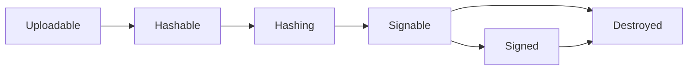

# Binaries

Binaries are the actual files distributed to your devices. They represent the compiled firmware images, executables, models, or any other content that needs to be deployed.

## Binary Components

Each binary consists of:

- **Record**: Metadata stored in Peridio (hash, size, target, state)
- **Content**: The actual file data stored in object storage

This separation enables efficient distribution and management at scale.

## Binary Lifecycle

Every binary progresses through a defined lifecycle:



### State Definitions

#### Uploadable

- Initial state after creation
- Ready to receive content via binary parts
- Can be reset to this state if upload fails

#### Hashable

- Upload complete, awaiting verification
- Triggers finalization of multipart uploads
- User indicates upload is finished

#### Hashing

- Peridio automatically verifies integrity
- Computes SHA-256 hash of content
- Validates against provided hash
- **Auto-transitions** to Signable when complete

#### Signable

- Content verified and ready for signing
- Awaiting cryptographic signature
- **Auto-transitions** to Signed when signature attached

#### Signed

- Fully validated and signed
- Ready for distribution in releases
- Can be included in bundles

#### Destroyed

- Content permanently deleted
- Record remains for audit trail
- Cannot be distributed or downloaded

## Creating Binaries

### Via Web Console

1. Navigate to artifact version
2. Click **Create Binary**
3. Upload file or use multipart upload
4. System automatically handles state transitions

### Via CLI

```bash
# Create binary
peridio binaries create \
  --artifact-version-prn $VERSION_PRN \
  --target "arm-linux-gnueabihf" \
  --hash $FILE_HASH \
  --size $FILE_SIZE

# Upload content
peridio binaries upload \
  --binary-prn $BINARY_PRN \
  --file firmware.bin
```

### Via API

```bash
# Create binary record
curl -X POST https://api.peridio.com/v1/binaries \
  -H "Authorization: Bearer $API_KEY" \
  -d '{
    "artifact_version_prn": "prn:1:artifact-version:...",
    "target": "arm-linux-gnueabihf",
    "hash": "sha256:abc123...",
    "size": 104857600
  }'
```

## Target Architecture

Binaries use target triplets to specify compatibility:

### Common Targets

```
x86_64-linux-gnu         # 64-bit Intel/AMD Linux
i686-linux-gnu          # 32-bit Intel Linux
aarch64-linux-gnu       # 64-bit ARM Linux
arm-linux-gnueabihf     # 32-bit ARM with hardware float
riscv64-linux-gnu       # 64-bit RISC-V Linux
x86_64-apple-darwin     # macOS Intel
aarch64-apple-darwin    # macOS Apple Silicon
```

### Custom Targets

Define custom targets for specialized hardware:

```
custom-soc-v1
proprietary-rtos-2.0
vendor-specific-platform
```

### Universal Binaries

Use `universal` for platform-agnostic content:

- Configuration files
- Machine learning models
- Media assets
- Documentation

## Uploading Content

### Direct Upload

For files under 100MB:

```bash
peridio binaries upload \
  --binary-prn $BINARY_PRN \
  --file firmware.bin
```

### Multipart Upload

For large files (>100MB):

1. Create binary parts:

```bash
# Split file into parts
split -b 10M firmware.bin part_

# Upload each part
for part in part_*; do
  peridio binary-parts create \
    --binary-prn $BINARY_PRN \
    --part-number $NUMBER \
    --file $part
done
```

2. Complete upload:

```bash
peridio binaries update \
  --prn $BINARY_PRN \
  --state hashable
```

### External Storage

Configure custom storage backends:

- AWS S3
- Azure Blob Storage
- Google Cloud Storage
- On-premises object storage

## Hash Verification

Peridio verifies binary integrity using SHA-256:

### Calculate Hash

```bash
# Linux/macOS
sha256sum firmware.bin

# Or using OpenSSL
openssl dgst -sha256 firmware.bin
```

### Provide Hash on Creation

```bash
HASH=$(sha256sum firmware.bin | cut -d' ' -f1)
SIZE=$(stat -f%z firmware.bin)  # macOS
SIZE=$(stat -c%s firmware.bin)  # Linux

peridio binaries create \
  --hash "sha256:$HASH" \
  --size $SIZE
```

## Binary Signatures

All binaries must be signed before distribution:

### Signing Process

1. Binary reaches `signable` state
2. Create signature using signing key
3. Attach signature to binary
4. Binary auto-transitions to `signed`

### Signature Creation

```bash
# Generate signature
openssl dgst -sha256 -sign private_key.pem \
  -out firmware.sig firmware.bin

# Attach to binary
peridio binary-signatures create \
  --binary-prn $BINARY_PRN \
  --signing-key-prn $KEY_PRN \
  --signature $(base64 firmware.sig)
```

## Binary Metadata

Enhance binaries with metadata:

```json
{
  "build_date": "2024-01-15T10:30:00Z",
  "git_commit": "abc123def",
  "compiler": "gcc-12.2.0",
  "features": ["wifi", "bluetooth", "usb"],
  "memory_required": 268435456,
  "storage_required": 1073741824
}
```

## Content Distribution

### CDN Delivery

Binaries are distributed via CDN for:

- Fast global downloads
- Reduced latency
- High availability
- Bandwidth optimization

### Download URLs

Devices receive pre-signed URLs:

```
https://cdn.peridio.com/binaries/abc123...?token=xyz
```

URLs are:

- Time-limited for security
- CDN-accelerated
- Region-optimized
- Resumable

## Binary Management

### Listing Binaries

```bash
# List all binaries for a version
peridio binaries list \
  --artifact-version-prn $VERSION_PRN

# Filter by target
peridio binaries list \
  --artifact-version-prn $VERSION_PRN \
  --target "arm-linux-gnueabihf"
```

### Binary Information

```bash
peridio binaries get --prn $BINARY_PRN
```

Output:

```json
{
  "prn": "prn:1:binary:...",
  "target": "arm-linux-gnueabihf",
  "hash": "sha256:abc123...",
  "size": 104857600,
  "state": "signed",
  "created_at": "2024-01-15T10:30:00Z"
}
```

### Resetting Failed Uploads

Reset to uploadable state:

```bash
peridio binaries update \
  --prn $BINARY_PRN \
  --state uploadable
```

This will:

- Delete existing binary parts
- Reset upload state
- Allow retry of upload

## Binary Destruction

### Destroying Binaries

⚠️ **Warning**: This is irreversible!

```bash
peridio binaries destroy --prn $BINARY_PRN
```

Effects:

- Content permanently deleted
- Record marked as destroyed
- Cannot be included in new releases
- Existing devices may fail to update

### When to Destroy

- Security vulnerabilities
- Legal/compliance requirements
- Accidental uploads
- Storage management

## Best Practices

### Upload Strategy

1. Calculate hash before upload
2. Use multipart for files >100MB
3. Implement retry logic
4. Verify upload completion

### Target Management

1. Use standard target triplets
2. Document custom targets
3. Test target compatibility
4. Plan for multi-arch support

### Security

1. Sign all binaries
2. Rotate signing keys periodically
3. Audit binary access
4. Monitor download patterns

### Storage Optimization

1. Compress binaries before upload
2. Use delta updates when possible
3. Clean up failed uploads
4. Archive old binaries

## Common Patterns

### Multi-Architecture Builds

```bash
# Build for multiple targets
TARGETS="x86_64-linux-gnu aarch64-linux-gnu arm-linux-gnueabihf"

for TARGET in $TARGETS; do
  # Build
  make TARGET=$TARGET

  # Create binary
  peridio binaries create \
    --artifact-version-prn $VERSION_PRN \
    --target $TARGET \
    --hash $(sha256sum output-$TARGET.bin | cut -d' ' -f1)

  # Upload
  peridio binaries upload \
    --binary-prn $BINARY_PRN \
    --file output-$TARGET.bin
done
```

### CI/CD Integration

```yaml
# GitHub Actions
- name: Upload Binary
  run: |
    HASH=$(sha256sum ${{ env.OUTPUT_FILE }} | cut -d' ' -f1)
    SIZE=$(stat -c%s ${{ env.OUTPUT_FILE }})

    BINARY_PRN=$(peridio binaries create \
      --artifact-version-prn ${{ env.VERSION_PRN }} \
      --target ${{ matrix.target }} \
      --hash "sha256:$HASH" \
      --size $SIZE \
      --output prn)

    peridio binaries upload \
      --binary-prn $BINARY_PRN \
      --file ${{ env.OUTPUT_FILE }}
```

## Troubleshooting

### Upload Failures

- Check network connectivity
- Verify file permissions
- Confirm hash matches
- Ensure sufficient storage quota

### State Transition Issues

- Verify previous state completed
- Check for signature attachment
- Review error logs
- Contact support if stuck

### Download Problems

- Verify binary is signed
- Check URL expiration
- Confirm CDN accessibility
- Test from different regions

## Next Steps

- [Binary Signatures](binary-signatures.md) - Sign your binaries
- [Binary Parts](/platform/reference/binary-parts) - Multipart uploads
- [Creating Binaries Guide](/platform/guides/creating-binaries) - Step-by-step tutorial
- [API Reference](/admin-api#binaries) - Complete API documentation
